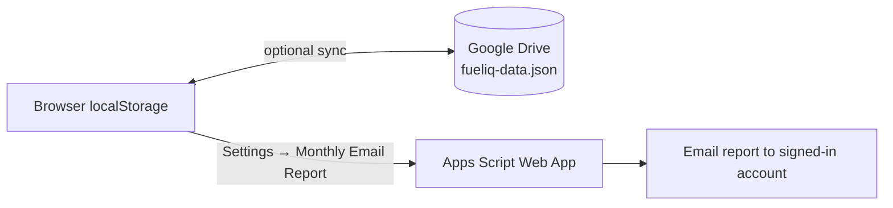

<div align="center">

# ⛽ Fuel IQ

**Premium vehicle management dashboard: fuel, expenses, efficiency, running costs and reminders, all in your browser.**

[](https://biseshkrmahato.github.io/Fuel/)
[](LICENSE)


[Live Demo](https://biseshkrmahato.github.io/Fuel/) · [Features](#features) · [Getting Started](#getting-started) · [Setup Guides](#setup-guides) · [Roadmap](#roadmap)

</div>

<!-- Add a screenshot for maximum impact:
<p align="center"></p>
-->

---

## Table of Contents

- [Overview](#overview)
- [Features](#features)
- [Getting Started](#getting-started)
- [Data Storage & Sync](#data-storage--sync)
- [Setup Guides](#setup-guides)
  - [Google Drive Sync](#google-drive-sync-setup)
  - [Monthly Email Reports](#monthly-email-reports-setup)
  - [GitHub Pages Deployment](#github-pages-deployment)
- [Technology](#technology)
- [Project Structure](#project-structure)
- [Privacy & Security](#privacy--security)
- [Backup Recommendation](#backup-recommendation)
- [Roadmap](#roadmap)
- [License](#license)
- [Author](#author)

---

## Overview

FuelIQ is a lightweight, browser-based vehicle management dashboard. It runs entirely on the client, needs no application server, and keeps your data under your control, stored locally with optional sync to your own Google Drive.

---

## Features

### 📊 Dashboard & Analytics

| Area | Details |
|------|---------|
| **KPIs** | Average fuel efficiency, true cost per km, fuel cost per km, total distance, fuel spend, other expenses, average fuel price |
| **Charts** | Interactive charts for efficiency and cost analysis, fuel-station spend and expense breakdowns |
| **Time filters** | All Time · This Month · 3 Months · 6 Months · YTD · 12 Months |
| **Annual summary** | Year-in-review for the selected vehicle: spending, distance and efficiency (where enough data exists) |

### ⛽ Fuel Tracking

Record each fill-up with **date, odometer, litres, amount, fuel price, fuel station and vehicle**. FuelIQ supports rolling-average efficiency calculations and configurable efficiency targets.

### 💰 Expense Management

Track non-fuel costs: service and maintenance, washing, tolls, repairs, insurance and other vehicle-related expenses.

### 🚘 Multiple Vehicles

- Add, switch between, and delete vehicles from the dashboard
- Keep separate logs and analytics per vehicle
- Per-vehicle settings: fuel/electric type, tank capacity, target efficiency, monthly budget

### 📇 Vehicle Details & Branding

Each vehicle can be given its own identity, purely for your own reference:

- **Rename** a vehicle at any time — every log, reminder, and setting that referenced the old name moves over automatically
- **Make/brand, model, and year**, shown next to the vehicle name in the picker
- **Automatic brand logo**: FuelIQ looks up the make's logo via [Clearbit's free logo API](https://clearbit.com/logo) based on its domain. If that fails to load (offline, or an unrecognized brand) or no make is set, it falls back to a small drawn car/bike silhouette that always works, no network required

### 🔔 Reminders

Create reminders for **service, insurance, PUC** or custom vehicle tasks, each with an optional due date and/or due odometer.

### 🎯 Budget & Efficiency Targets

| Setting | Purpose |
|---------|---------|
| Monthly vehicle budget | Track spending against a monthly limit |
| Target KMPL | Benchmark efficiency |
| Rolling efficiency window | Smooth efficiency calculations |
| Calculation mode | Choose how efficiency is computed |
| Tank capacity & vehicle type | Vehicle-specific context |

These settings feed the dashboard and the monthly reports.

### ☁️ Google Drive Sync

Sign in with Google and FuelIQ keeps your data in **your own** Google Drive automatically — no setup, no API keys to paste in.

- Uses the restricted `drive.file` scope, so FuelIQ can only ever see the one file it creates, never the rest of your Drive
- Every change syncs a couple of seconds after you make it; a manual **Sync Now** is also available
- A new user (or a browser that's never signed in) always starts completely blank — no sample data
- Refreshing or reopening the app reconnects silently; you're not asked to sign in again
- Switching Google accounts on the same device never mixes data between accounts — each account only ever sees its own file

### 📧 Monthly Email Reports

FuelIQ can automatically email a vehicle report through a Google Apps Script backend, on the 1st of every month.

- Select the reporting month and vehicle, preview the report, or send it immediately
- Connect the dashboard to your own Apps Script Web App (one-time setup)
- Enable a recurring previous-month report with a single click
- Generates the email body and metrics from your own logged data

> [!NOTE]
> There's no recipient field to fill in — the report is always sent to whichever Google account you're currently signed into FuelIQ with. Sign in with Google before enabling or sending a report.

### 📁 Import / Export

CSV export and bulk import · JSON backup and restore · Print / save dashboard as PDF

### 🌙 Responsive UI

Desktop, tablet and mobile layouts with dark/light mode, mobile bottom navigation, responsive KPI cards and charts, touch-friendly controls, mobile-safe tables and PWA-style mobile metadata.

---

## Getting Started

FuelIQ is a client-side app, so you can open `index.html` directly in a browser.

For the full experience, including Google sign-in and Drive sync, serve it from an **authorized HTTPS origin** such as GitHub Pages:

```text
https://biseshkrmahato.github.io/Fuel/
```

---

## Data Storage & Sync



- **Local by default:** application state lives in browser `localStorage`, so the dashboard works without a server.
- **Optional cloud layer:** with Google Drive Sync enabled, the dataset is backed up to `fueliq-data.json` in the signed-in user's Drive and can be shared across devices.

---

## Setup Guides

### Google Drive Sync Setup

This app's hosted copy already has sign-in configured — most people only need to do this:

1. Open FuelIQ.
2. Click **Sign in with Google**.
3. Authorize the requested permissions.
4. FuelIQ creates and keeps `fueliq-data.json` in sync automatically from then on.

> [!IMPORTANT]
> If you're running your **own** deployment (a different domain/origin from the live demo above), you'll need your own Google Cloud OAuth Client ID with that exact origin added to **Authorised JavaScript origins**, and to paste it into the `GDRIVE_CLIENT_ID` constant near the top of the Google Drive Sync script in `index.html`. The Client ID baked into this repo's copy only works from `biseshkrmahato.github.io`.

### Monthly Email Reports Setup

The workflow has two parts:

| Part | Responsibility |
|------|----------------|
| **FuelIQ frontend** (Settings → Monthly Email Report) | Pick the report month and vehicle, paste your Apps Script Web App URL, preview and send reports |
| **Google Apps Script backend** | Read FuelIQ data, calculate monthly metrics, build the report, email it to your signed-in account, and run the previous-month report automatically |

**Setup steps**

1. Create or open the Google Apps Script project.
2. Add the FuelIQ monthly-report backend.
3. Authorize the script.
4. Deploy it as a **Web App**, executing as yourself.
5. Copy the deployed `/exec` URL.
6. In FuelIQ, sign in with Google, then open **Settings → Monthly Email Report** and paste the URL.
7. Pick a month and vehicle, then use **Preview** or **Send Now** to test.
8. Click **Enable Monthly Email** for automatic delivery on the 1st of each month — the report always goes to whichever Google account you're signed in with.

**Automatic reporting.** A time-based trigger on the `sendPreviousMonthReport` function runs on the first day of each month:

| Runs on | Report sent |
|---------|-------------|
| 1 October | September |
| 1 November | October |
| 1 December | November |

### GitHub Pages Deployment

1. Push `index.html` to the repository.
2. Go to **Settings → Pages**.
3. Select the deployment branch and folder, then save.
4. Open the generated Pages URL.

To publish updates:

```bash
git add index.html
git commit -m "Update FuelIQ dashboard"
git push
```

---

## Technology

FuelIQ is intentionally lightweight and primarily client-side.

| Layer | Tools |
|-------|-------|
| **Core** | HTML5, CSS3, JavaScript, browser `localStorage` |
| **Visualization** | Chart.js |
| **Google integration** | Google Identity Services, Google Drive REST API, Google Apps Script, Gmail / Apps Script email delivery |
| **Branding** | [Clearbit Logo API](https://clearbit.com/logo) (keyless, offline silhouette fallback) |
| **Fonts** | Chakra Petch, DM Sans |

> [!NOTE]
> Chart.js, Google Identity Services, Clearbit logos, and web fonts are loaded from external CDNs/services — each degrades gracefully (silhouette icon, hidden charts, etc.) if one is blocked or slow.

---

## Project Structure

```text
.
├── index.html   # Single-page dashboard: UI, styling and JavaScript
├── LICENSE      # MIT License
└── README.md
```

The Google Apps Script project used for the monthly email/PDF backend is maintained separately.

---

## Privacy & Security

FuelIQ is designed around user-controlled storage.

- Dashboard data is stored locally in the browser.
- Google Drive sync stores the backup in the signed-in user's own Drive, scoped to the one file FuelIQ creates — nothing else in that Drive is ever visible to the app.
- Each Google account gets its own separate backup file; signing in as a different account never mixes data.
- Monthly email delivery requires the separately configured Apps Script backend, and always targets the signed-in account — there is no other recipient configuration.
- No traditional application server is required for normal operation.

> [!WARNING]
> Never commit private data, API secrets, service-account credentials or Apps Script credentials to the repository.

---

## Backup Recommendation

Even with Drive sync enabled, export a JSON backup periodically from **Settings → Backup Data (JSON)** and keep an offline copy if your vehicle history matters to you.

---

## Roadmap

- [ ] Service-cost forecasting
- [ ] Fuel-price trend alerts
- [ ] Maintenance cost analytics
- [ ] More detailed trip analytics
- [ ] Multi-vehicle comparison dashboards
- [ ] PWA installation and offline enhancements
- [ ] More report customization
- [ ] Additional notification channels

---

## License

Released under the **MIT License**. See [`LICENSE`](LICENSE) for the full text.

Copyright © 2026 biseshkrmahato

---

## Author

**Bisesh Kumar Mahato**
FuelIQ: Premium Vehicle Management
