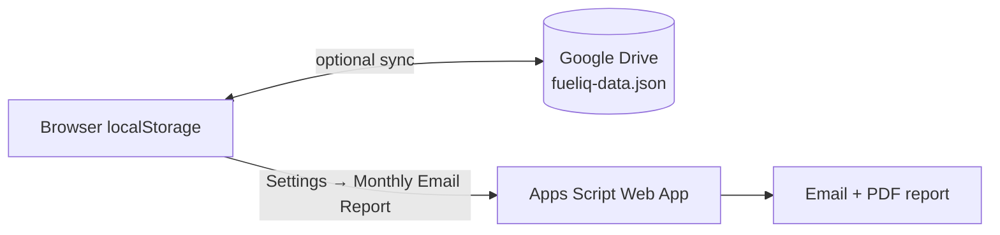

<div align="center">

# ⛽ FuelIQ

**Premium vehicle management dashboard: fuel, expenses, efficiency, running costs and reminders, all in your browser.**

[](https://biseshkmahato.github.io/Fuel/)
[](LICENSE)


[Live Demo](https://biseshkmahato.github.io/Fuel/) · [Features](#features) · [Getting Started](#getting-started) · [Setup Guides](#setup-guides) · [Roadmap](#roadmap)

</div>

<!-- Add a screenshot for maximum impact:
<p align="center"></p>
-->

---

## Table of Contents

- [Overview](#overview)
- [Features](#features)
- [Getting Started](#getting-started)
- [Data Storage & Sync](#data-storage--sync)
- [Setup Guides](#setup-guides)
  - [Google Drive Sync](#google-drive-sync-setup)
  - [Monthly Email Reports](#monthly-email-reports-setup)
  - [GitHub Pages Deployment](#github-pages-deployment)
- [Technology](#technology)
- [Project Structure](#project-structure)
- [Privacy & Security](#privacy--security)
- [Backup Recommendation](#backup-recommendation)
- [Roadmap](#roadmap)
- [License](#license)
- [Author](#author)

---

## Overview

FuelIQ is a lightweight, browser-based vehicle management dashboard. It runs entirely on the client, needs no application server, and keeps your data under your control, stored locally with optional sync to your own Google Drive.

---

## Features

### 📊 Dashboard & Analytics

| Area | Details |
|------|---------|
| **KPIs** | Average fuel efficiency, true cost per km, fuel cost per km, total distance, fuel spend, other expenses, average fuel price |
| **Charts** | Interactive charts for efficiency and cost analysis, fuel-station spend and expense breakdowns |
| **Time filters** | All Time · This Month · 3 Months · 6 Months · YTD · 12 Months |
| **Annual summary** | Year-in-review for the selected vehicle: spending, distance and efficiency (where enough data exists) |

### ⛽ Fuel Tracking

Record each fill-up with **date, odometer, litres, amount, fuel price, fuel station and vehicle**. FuelIQ supports rolling-average efficiency calculations and configurable efficiency targets.

### 💰 Expense Management

Track non-fuel costs: service and maintenance, washing, tolls, repairs, insurance and other vehicle-related expenses.

### 🚘 Multiple Vehicles

- Add and switch between vehicles from the dashboard
- Store vehicle-specific details, including vehicle type and tank capacity
- Keep separate logs and analytics per vehicle

### 🔔 Reminders

Create reminders for **service, insurance, PUC** or custom vehicle tasks, each with an optional due date and/or due odometer.

### 🎯 Budget & Efficiency Targets

| Setting | Purpose |
|---------|---------|
| Monthly vehicle budget | Track spending against a monthly limit |
| Target KMPL | Benchmark efficiency |
| Rolling efficiency window | Smooth efficiency calculations |
| Calculation mode | Choose how efficiency is computed |
| Tank capacity & vehicle type | Vehicle-specific context |

These settings feed the dashboard and the monthly reports.

### ☁️ Google Drive Sync

Sign in with Google to synchronize your data to **your own** Google Drive as `fueliq-data.json`.

- Uses the restricted `drive.file` scope, so FuelIQ accesses only the file it creates, not your whole Drive
- Automatic sync after changes, plus manual sync from the Google Drive settings

### 📧 Monthly Email Reports

Send a vehicle report by email through a Google Apps Script backend.

- Select the reporting month and vehicle
- Preview the report, or send it immediately
- Connect the dashboard to an Apps Script Web App
- Automate previous-month reports with a time-based trigger
- Generates the email and a PDF attachment

### 📁 Import / Export

CSV export and bulk import · JSON backup and restore · Print / save dashboard as PDF

### 🌙 Responsive UI

Desktop, tablet and mobile layouts with dark/light mode, mobile bottom navigation, responsive KPI cards and charts, touch-friendly controls, mobile-safe tables and PWA-style mobile metadata.

---

## Getting Started

FuelIQ is a client-side app, so you can open `index.html` directly in a browser.

For the full experience, including Google sign-in and Drive sync, serve it from an **authorized HTTPS origin** such as GitHub Pages:

```text
https://biseshkmahato.github.io/Fuel/
```

---

## Data Storage & Sync



- **Local by default:** application state lives in browser `localStorage`, so the dashboard works without a server.
- **Optional cloud layer:** with Google Drive Sync enabled, the dataset is backed up to `fueliq-data.json` in the signed-in user's Drive and can be shared across devices.

---

## Setup Guides

### Google Drive Sync Setup

1. Open FuelIQ.
2. Click **Sign in with Google**.
3. Authorize the requested Google permissions.
4. FuelIQ creates and synchronizes its `fueliq-data.json` backup.
5. The signed-in account is shown in the dashboard.

> [!IMPORTANT]
> The Google OAuth client must have your deployed website origin authorized in its Google Cloud project.

### Monthly Email Reports Setup

The workflow has two parts:

| Part | Responsibility |
|------|----------------|
| **FuelIQ frontend** (Settings → Monthly Email Report) | Configure report month, vehicle, recipient and Apps Script Web App URL; preview and send reports |
| **Google Apps Script backend** | Read FuelIQ data, calculate monthly metrics, build the report and PDF, send the email, run the previous-month report automatically |

**Setup steps**

1. Create or open the Google Apps Script project.
2. Add the FuelIQ monthly-report backend.
3. Authorize the script.
4. Deploy it as a **Web App**.
5. Set the Web App to execute as the script owner.
6. Configure access according to your intended use.
7. Copy the deployed `/exec` URL.
8. In FuelIQ, open **Settings → Monthly Email Report** and paste the URL.
9. Select the recipient and report month.
10. Use **Preview** or **Send Now** to test.
11. Add a time-based trigger for automatic monthly delivery.

**Automatic reporting.** Create a time-based trigger for the `sendPreviousMonthReport` function, typically on the first day of each month:

| Runs on | Report sent |
|---------|-------------|
| 1 October | September |
| 1 November | October |
| 1 December | November |

### GitHub Pages Deployment

1. Push `index.html` to the repository.
2. Go to **Settings → Pages**.
3. Select the deployment branch and folder, then save.
4. Open the generated Pages URL.

To publish updates:

```bash
git add index.html
git commit -m "Update FuelIQ dashboard"
git push
```

---

## Technology

FuelIQ is intentionally lightweight and primarily client-side.

| Layer | Tools |
|-------|-------|
| **Core** | HTML5, CSS3, JavaScript, browser `localStorage` |
| **Visualization** | Chart.js |
| **Google integration** | Google Identity Services, Google Drive REST API, Google Apps Script, Gmail / Apps Script email delivery |
| **Fonts** | Chakra Petch, DM Sans |

> [!NOTE]
> Chart.js, Google Identity Services and web fonts are loaded from external CDNs/services.

---

## Project Structure

```text
.
├── index.html   # Single-page dashboard: UI, styling and JavaScript
├── LICENSE      # MIT License
└── README.md
```

The Google Apps Script project used for the monthly email/PDF backend is maintained separately.

---

## Privacy & Security

FuelIQ is designed around user-controlled storage.

- Dashboard data is stored locally in the browser.
- Google Drive sync stores the backup in the signed-in user's own Drive, scoped to the file FuelIQ creates.
- Monthly email delivery requires the separately configured Apps Script backend.
- No traditional application server is required for normal operation.

> [!WARNING]
> Never commit private data, API secrets, service-account credentials or Apps Script credentials to the repository.

---

## Backup Recommendation

Even with Drive sync enabled, export a JSON backup periodically from **Settings → Backup Data (JSON)** and keep an offline copy if your vehicle history matters to you.

---

## Roadmap

- [ ] Service-cost forecasting
- [ ] Fuel-price trend alerts
- [ ] Maintenance cost analytics
- [ ] More detailed trip analytics
- [ ] Multi-vehicle comparison dashboards
- [ ] PWA installation and offline enhancements
- [ ] More report customization
- [ ] Additional notification channels

---

## License

Released under the **MIT License**. See [`LICENSE`](LICENSE) for the full text.

Copyright © 2026 biseshkrmahato

---

## Author

**Bisesh Kumar Mahato**
FuelIQ: Premium Vehicle Management
